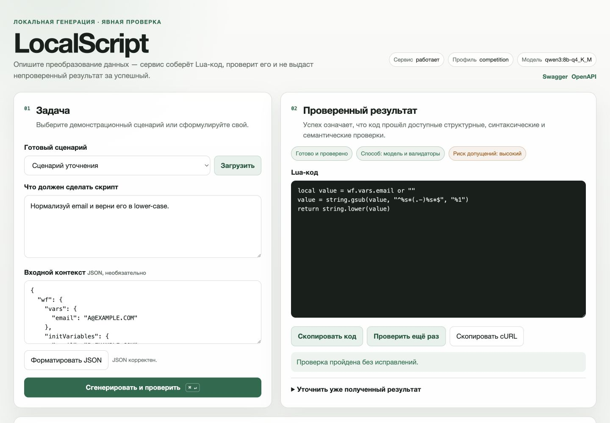
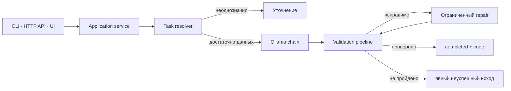

# LocalScript

Локальный сервис, который генерирует небольшие Lua-скрипты через Ollama, проверяет их и явно отделяет успешный результат от уточнения или ошибки.



LocalScript предназначен для задач преобразования данных в окружении workflow: прочитать значения из `wf.vars` или `wf.initVariables`, отфильтровать массив, нормализовать строку, собрать объект или вернуть JSON envelope с Lua-блоками. Модель предлагает решение, а детерминированный pipeline проверяет форму ответа, ограничения среды, синтаксис Lua 5.4 и доступные семантические свойства.

Главный контракт проекта: **непроверенный код не возвращается как успешная генерация**. Если данных недостаточно, сервис задаёт один вопрос. Если модель недоступна или проверка не пройдена после ограниченного repair-цикла, API возвращает явный неуспешный исход без поля `code`.

## Зачем это нужно

Обычная генерация кода заканчивается текстом модели. LocalScript добавляет вокруг неё управляемый локальный контур:

- запрос и контекст остаются на машине с Ollama после загрузки модели;
- planner формирует типизированное описание задачи;
- неоднозначный root приводит к уточнению, а не к молчаливой догадке;
- кандидат проверяется несколькими независимыми слоями;
- repair ограничен двумя раундами и не маскирует неуспех;
- сессия, проверка и безопасная трассировка доступны через API и UI;
- один application service используется из HTTP API, CLI и браузерного интерфейса.

Это исследовательский локальный инструмент, а не среда исполнения недоверенного кода и не универсальный генератор Lua. Поддерживаемая область и ограничения описаны ниже.

## Быстрый запуск через Docker Compose

Понадобятся Docker с Compose v2, доступная NVIDIA GPU и настроенный NVIDIA Container Toolkit. Образы привязаны к конкретным версиям, сервис публикуется только на loopback-интерфейсе.

```bash
git clone https://github.com/Ev0lv3nta/localscript.git
cd localscript
docker compose up -d ollama
docker compose exec ollama ollama pull qwen3:8b-q4_K_M
docker compose exec ollama ollama pull qwen3:4b-instruct-2507-q4_K_M
docker compose up --build localscript
```

После готовности контейнеров:

- UI: <http://127.0.0.1:8080/>
- Swagger: <http://127.0.0.1:8080/docs>
- readiness: <http://127.0.0.1:8080/ready>

Остановка:

```bash
docker compose down
```

Модель хранится в `artifacts/ollama_home` и не коммитится. Первый `pull` загружает несколько гигабайт. Для другого порта задайте `LOCALSCRIPT_PORT` перед `docker compose up`.

## Локальный запуск без контейнера

Поддерживаются Python 3.11 и 3.12. Нужны `uv`, локальная Ollama и модель `qwen3:8b-q4_K_M`.

```bash
uv sync --frozen --all-extras --python 3.12
./scripts/bootstrap_lua54.sh
ollama pull qwen3:8b-q4_K_M
make run
```

`make run` проверяет версию Python, доступность Ollama, наличие primary и fallback tags, политику bind-адреса и свободный порт. По умолчанию сервис слушает только `127.0.0.1:8080`, UI включён.

Ключевые настройки можно передать переменными окружения:

```bash
LOCALSCRIPT_PORT=8090 \
LOCALSCRIPT_PRIMARY_MODEL=qwen3:8b-q4_K_M \
LOCALSCRIPT_FALLBACK_MODEL=qwen3:4b-instruct-2507-q4_K_M \
make run
```

Полный список безопасных defaults находится в [`competition.yaml`](app/resources/config/profiles/competition.yaml) и [`.env.example`](.env.example).

## HTTP API

Простой endpoint возвращает только проверенный код:

```bash
curl -s http://127.0.0.1:8080/generate \
  -H 'Content-Type: application/json' \
  -d '{
    "prompt": "Нормализуй wf.vars.email и верни строку в нижнем регистре",
    "context": {"wf": {"vars": {"email": "USER@EXAMPLE.COM"}}}
  }'
```

Ответ при успехе:

```json
{"code":"local value = wf.vars.email or \"\"\nreturn string.lower(value)"}
```

Для интерфейса, итераций и диагностики используется `POST /api/generate`. Он возвращает `status`, `session_id`, `trace_id`, стратегию, допущения и сводку проверки. Возможные исходы:

| Статус | Значение | Публикуется `code` |
|---|---|---:|
| `completed` | Все обязательные проверки пройдены | да |
| `clarification_required` | Нужен один ответ пользователя | нет |
| `validation_failed` | Кандидат не прошёл проверку | нет |
| `policy_rejected` | Запрос выходит за разрешённую границу | нет |
| `backend_unavailable` | Ollama или модель недоступны | нет |

Продолжение уточнения отправляется в ту же сессию:

```json
{
  "session_id": "<uuid>",
  "clarification_answer": "Используй wf.vars.email"
}
```

Самостоятельная проверка кода доступна через `POST /api/validate`. Полная и всегда актуальная схема — в Swagger и `/openapi.json`.

## CLI

После `uv sync` команда `localscript` доступна из виртуального окружения:

```bash
.venv/bin/localscript generate --prompt "Верни последний элемент wf.vars.items"
.venv/bin/localscript interact --prompt "Нормализуй email"
.venv/bin/localscript verify --code-file example.lua
.venv/bin/localscript doctor
```

`interact` сохраняет идентификатор сессии для ответа на уточнение или последующей правки. `doctor --judge` — дорогая GPU-проверка выбранной модели; это релизный инструмент, а не обычная healthcheck-команда.

## Как устроена генерация



Основные границы ответственности:

- `app/generation` — разрешение задачи, planner/writer chain и state machine;
- `app/families` — типизированный registry поддерживаемых семейств;
- `app/validation` — структурная, синтаксическая, policy- и semantic-проверка;
- `app/repair` — канонические замены и локальные исправления;
- `app/api`, `app/cli`, `app/ui` — транспортные адаптеры без собственной бизнес-логики;
- `app/evaluation` — целостность корпусов, метрики, повторы и ablation.

Подробнее: [архитектура](docs/architecture.md) и принятые [ADR](docs/adr/).

## Что именно проверяется

Pipeline последовательно проверяет:

1. тип и размер входа, глубину и число узлов контекста;
2. форму Lua block или JSON envelope;
3. запрещённые roots, глобальные мутации и неподдерживаемые конструкции;
4. синтаксис через `luac`;
5. ограниченное выполнение Lua в subprocess с лимитами;
6. семантические инварианты известного family, если они надёжно определены;
7. согласованность финального typed outcome.

Проверки не доказывают корректность произвольной программы. Для неизвестного family доступны только общие инварианты, поэтому результат нужно рассматривать как проверенный в рамках заявленного pipeline, а не математически доказанный.

## Оценка качества

В репозитории разделены три контура:

- `regression` — 140 исторических и синтетических кейсов для разработки;
- `public-v1` — 12 семантических кейсов без reference code в prompt;
- private holdout — 8 замороженных кейсов вне Git, используемых один раз для релиза.

Integrity check ищет точные, нормализованные и нечёткие пересечения между корпусами, базой примеров и holdout. Release gate фиксирует SHA коммита, хеши наборов, версии Python/Lua/Ollama, digest модели, GPU, метрики стадий, стабильность трёх повторов и ablation-профили.

Результаты `v0.2.0` публикуются как JSON-артефакт GitHub Release. Они подтверждают работу конкретной ревизии в зафиксированном окружении и не являются заявлением об обобщающей способности на любые Lua-задачи. Методика: [docs/evaluation.md](docs/evaluation.md).

## Разработка

Основная локальная проверка совпадает с CI:

```bash
make check
```

Она устанавливает зависимости из lock-файла, запускает Ruff и mypy, проверяет лицензии и целостность eval-корпусов, подготавливает Lua, выполняет unit suite и проверяет wheel/sdist из чистого окружения.

Отдельные команды:

```bash
make quality-check
make test-unit
make build-check
make container-check
```

CI работает на Python 3.11 и 3.12. Required aggregator становится зелёным только после unit, static analysis, package, container, policy, eval integrity и full-history secret scan. Правила участия и структура PR описаны в [CONTRIBUTING.md](CONTRIBUTING.md), локальная среда — в [docs/development.md](docs/development.md).

## Ограничения и безопасность

- Это не production sandbox. Lua выполняется в отдельном subprocess с лимитами, но без VM-изоляции уровня gVisor или Firecracker.
- Сервис по умолчанию доступен только через loopback. Внешний bind разрешается лишь при явном remote mode и bearer token длиной не менее 32 символов.
- Локальность относится к inference после загрузки модели. Docker/Ollama и модель нужно получить из внешних registry один раз.
- Трассировки редактируют код и приватные model artifacts, но prompt и рабочий контекст всё равно следует считать чувствительными локальными данными.
- Поддерживается ограниченный диалект LocalScript/Lua и известные workflow-roots, а не произвольная системная автоматизация.
- При отсутствии Lua runtime семантическая проверка не объявляется полной.

Полная модель угроз, сетевые defaults и порядок сообщения об уязвимостях: [SECURITY.md](SECURITY.md) и [docs/security.md](docs/security.md).

## Происхождение

Проект начался как личный прототип для задачи MWS Octapi на MTS True Tech Hack 2026. Автор — Николай Никитенко; соавторов нет, проект не занял призового места. Репозиторий не является официальным продуктом или проектом МТС/MWS.

Хакатонный снимок сохранён отдельно и не переписывается. Новый репозиторий получил чистую документированную историю: курируемый импорт, небольшие PR, обязательный CI и воспроизводимый release gate. Подробнее — в [истории проекта](docs/history/hackathon-origin.md) и [манифесте импорта](docs/history/import-manifest.md).

## Лицензия

Код распространяется по лицензии [MIT](LICENSE). Лицензии runtime-зависимостей и vendored Lua перечислены в [THIRD_PARTY_NOTICES.md](THIRD_PARTY_NOTICES.md).

История релизов: [CHANGELOG.md](CHANGELOG.md). Демонстрационный сценарий: [docs/demo.md](docs/demo.md).
