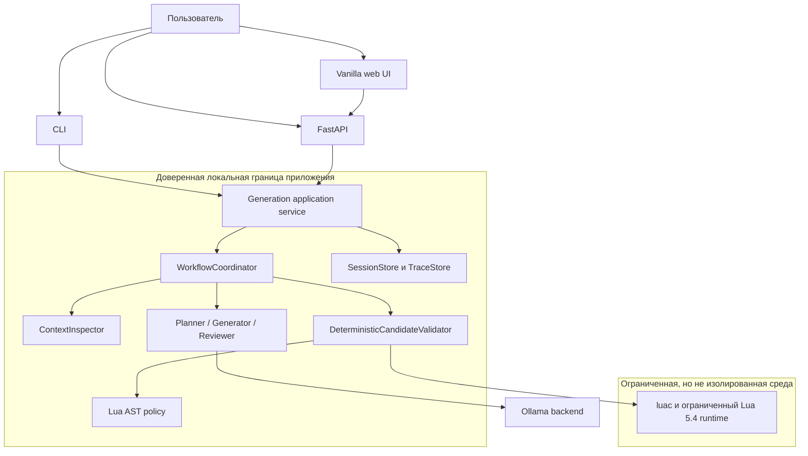
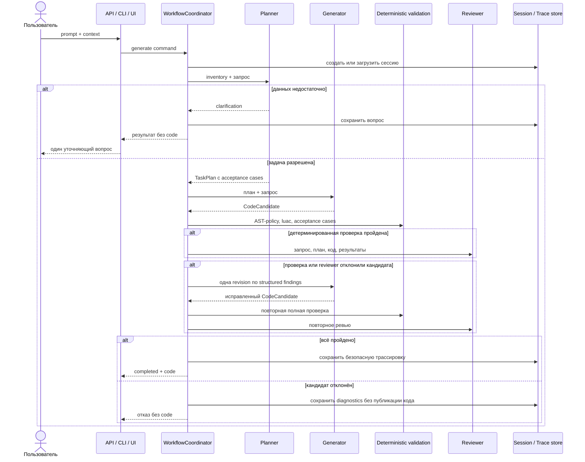

# Архитектура LocalScript

## Контекст и границы

LocalScript — один локальный application service с тремя адаптерами: HTTP API, CLI и небольшой web UI. Адаптеры не принимают продуктовых решений: они приводят ввод к общей команде и отображают типизированный `GenerationOutcome`.

Ollama может работать как локальный процесс либо как Compose service `ollama`. Произвольный удалённый host по умолчанию запрещён. Сетевой сервис также слушает loopback, пока оператор явно не включит remote mode и bearer-аутентификацию.

## Последовательность запроса

## Контракты

### План задачи

Единственный детерминированный разбор ввода — `ContextInventory`: обход `wf.vars` и `wf.initVariables` с типами значений и типизированными путями. Естественный язык кодом не классифицируется.

`TaskPlan` содержит цель, входные `WorkflowPath`, `OutputContract`, упорядоченные шаги, ограничения и от одного до трёх исполнимых acceptance cases. План неизменяем и полностью определяет, что именно проверяется дальше; альтернатива плану — `ClarificationRequest` с одним конкретным вопросом.

### Typed outcome

`GenerationOutcome` допускает пять статусов. Только `completed` может содержать непустой `code`, и только вместе с `ValidationOutcome(PASSED)`. Это проверяется самим immutable domain-объектом, generation engine и HTTP adapters.

### Validation

Валидация не переписывает код. Она проверяет соответствие `OutputContract`, анализирует Lua через AST-policy, компилирует чанки `luac`, выполняет кандидата в ограниченном runtime на каждом acceptance case и сравнивает результат с ожидаемым JSON по структуре. Каждый check имеет стабильный `code` и сообщение; ошибка любой стадии означает, что код не публикуется.

Ожидаемая форма результата берётся из плана конкретного запроса, а не из зарегистрированной таблицы семейств, поэтому проверка не замкнута на реализацию.

### Revision

Deterministic-отказ или отклонение reviewer даёт ровно одну полноценную revision: generator получает план, отклонённый код и structured findings и возвращает нового кандидата, который проходит полную проверку и ревью заново. Строковых правок кода, канонических шаблонов и task-specific repair нет.

### Состояние

Session и trace идентификаторы — UUID. Записи выполняются атомарно с блокировками, индексом, retention и quarantine повреждённых файлов. Writable state хранится вне checkout в XDG/user state или каталоге `LOCALSCRIPT_STATE_DIR`.

Trace предназначен для диагностики, а не для полного model transcript: код и приватные model artifacts редактируются перед записью. Runtime lock создаётся только успешным judged/release pipeline и привязан к SHA ревизии.

## Структура решений

Архитектурные решения фиксируются короткими ADR в [`docs/adr`](adr/): outcome contract, typed agentic workflow, границы eval-корпусов и evidence. Решения о task resolver, реестре семейств и границах repair отмечены как заменённые ADR 0007, а не удалены. Изменение публичного контракта начинается с ADR или обновления существующего решения, затем получает тест контракта.

## Осознанные ограничения

Проект остаётся небольшим модульным монолитом. Отдельный frontend framework, база данных, очередь задач и микросервисы не добавлены: для локального single-user сценария они увеличили бы поверхность отказа без продуктовой пользы.

Это ролевой workflow на одной локальной модели, а не автономная multi-agent система. Reviewer работает на той же модели, что и generator, поэтому он ловит расхождение с планом, но не заменяет независимую экспертизу. Обычный запрос стоит трёх обращений к модели вместо одного — плата за то, что решение принимает модель, а не таблица правил.
