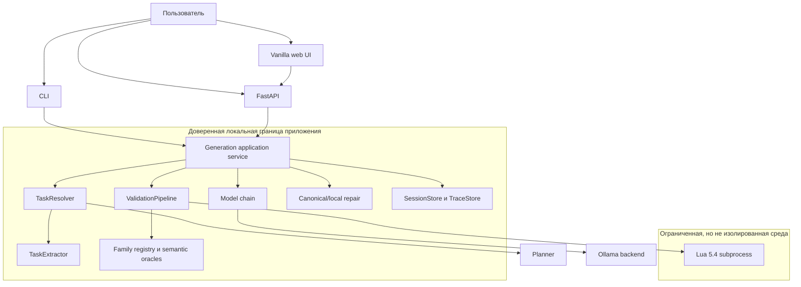
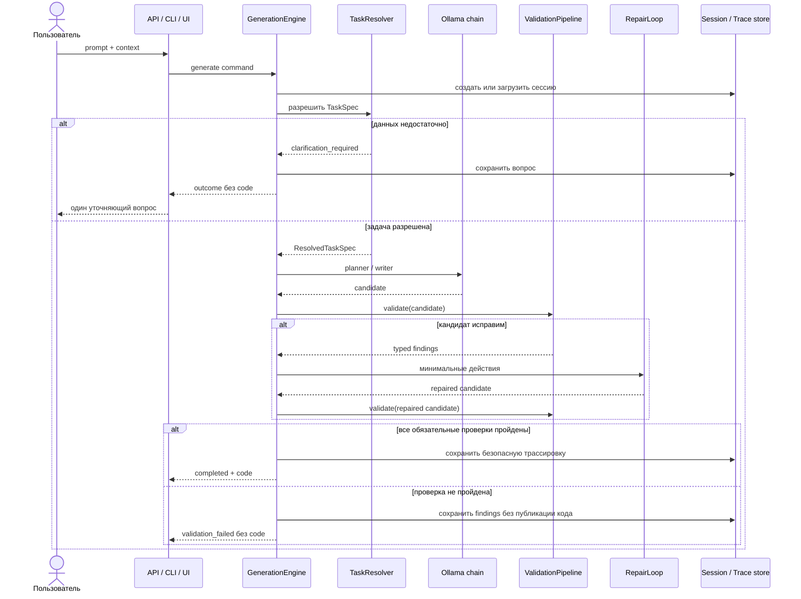

# Архитектура LocalScript

## Контекст и границы

LocalScript — один локальный application service с тремя адаптерами: HTTP API, CLI и небольшой web UI. Адаптеры не принимают продуктовых решений: они приводят ввод к общей команде и отображают типизированный `GenerationOutcome`.

Ollama может работать как локальный процесс либо как Compose service `ollama`. Произвольный удалённый host по умолчанию запрещён. Сетевой сервис также слушает loopback, пока оператор явно не включит remote mode и bearer-аутентификацию.

## Последовательность запроса

## Контракты

### Task specification

`TaskSpec` хранит нормализованный prompt, ожидаемый output style, возможный root, найденные paths, оценки неоднозначности и композиции, family hints и явные допущения. `ResolvedTaskSpec` фиксирует решение resolver и не изменяется в ходе генерации.

Extractor даёт доверенные детерминированные hints только для узких распознаваемых семейств. Planner может предложить family, но неизвестное значение закрывается в `generic_lua` и не получает специализированный oracle.

### Typed outcome

`GenerationOutcome` допускает пять статусов. Только `completed` может содержать непустой `code`, и только вместе с `ValidationOutcome(PASSED)`. Это проверяется самим immutable domain-объектом, generation engine и HTTP adapters.

### Validation

Pipeline не переписывает код скрытно. Он нормализует только однозначно распознаваемое представление, затем выполняет structural, policy, syntax, runtime и semantic stages. Findings имеют стабильный `code`, severity и stage.

Семантические oracles зарегистрированы рядом с family-модулями. Общая валидация применяется всегда; специализированная — только когда family получен из доверенного источника.

### Repair

Каноническая генерация для известных узких случаев отделена от repair. Repair получает существующий candidate и typed findings, применяет только разрешённые минимальные действия и повторно отправляет результат в полный validation pipeline. Число раундов ограничено профилем.

### Состояние

Session и trace идентификаторы — UUID. Записи выполняются атомарно с блокировками, индексом, retention и quarantine повреждённых файлов. Writable state хранится вне checkout в XDG/user state или каталоге `LOCALSCRIPT_STATE_DIR`.

Trace предназначен для диагностики, а не для полного model transcript: код и приватные model artifacts редактируются перед записью. Runtime lock создаётся только успешным judged/release pipeline и привязан к SHA ревизии.

## Структура решений

Архитектурные решения фиксируются короткими ADR в [`docs/adr`](adr/): outcome contract, task resolution, family registry, границы eval-корпусов, evidence и repair. Изменение публичного контракта начинается с ADR или обновления существующего решения, затем получает тест контракта.

## Осознанные ограничения

Проект остаётся небольшим модульным монолитом. Отдельный frontend framework, база данных, очередь задач и микросервисы не добавлены: для локального single-user сценария они увеличили бы поверхность отказа без продуктовой пользы. TaskExtractor остаётся крупным rule-based classifier, но orchestration, family behavior, validation и repair вынесены из него и тестируются отдельно.
